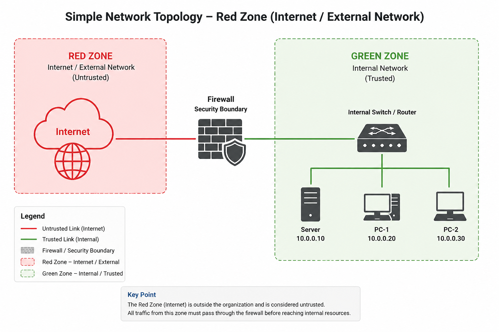
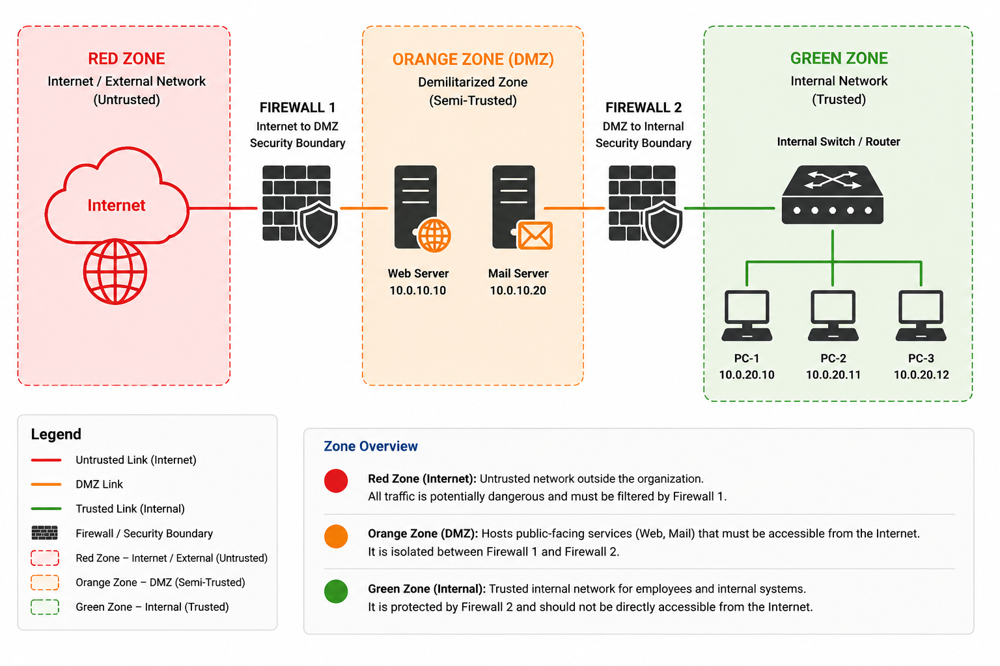
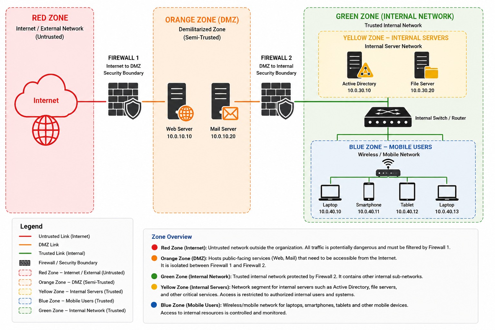

### Overview

Network segmentation is a fundamental part of network security, allowing an environment to be divided into separate zones based on trust, function, and security requirements. These zones are often represented using colors such as **red, orange, yellow, green, and blue**, with each color indicating a different level of trust or a specific security purpose. By combining these security zones with different network topologies, organizations can control how systems communicate, isolate sensitive resources, and limit the potential impact of a security incident.

In this article, we’ll explore the most common zone colors, what they represent, and how they are applied across different network topologies.

### Red Zone — Internet / External Network

The **red zone** represents the **Internet or an external, untrusted network**. It is typically used to identify networks or systems that are outside the organization’s direct control and should therefore be treated as potentially hostile. In a network topology diagram, the red zone provides a clear visual boundary between the organization’s trusted infrastructure and the outside world.

### Green Zone — Internal Network

The **green zone** represents the **trusted internal network**, where internal users, workstations, and private organizational resources are located. Although the zone is commonly referred to as trusted, this does not mean that all internal traffic should be automatically trusted; segmentation, access controls, monitoring, and least-privilege principles should still be applied to limit lateral movement if an internal system or user account is compromised.

### Orange Zone — DMZ

The **orange zone** represents the **Demilitarized Zone (DMZ)**, a **semi-trusted network** designed to host systems that need to be accessible from external networks while keeping them isolated from the internal network. Typical examples include web servers, mail servers, DNS servers, and other public-facing services. In a properly segmented architecture, the DMZ is protected by firewall rules that control traffic between the Internet, the DMZ, and the internal network, limiting communication to only the services and ports that are required.

### Yellow Zone — Internal Servers

The **yellow zone** represents the **internal server network**, where servers that provide services to users and internal applications are hosted. These systems are not normally exposed directly to the Internet, but they may contain important organizational resources such as application servers, file servers, database servers, and other internal services. Separating servers from user workstations allows administrators to apply specific access controls between users and server resources, helping limit unauthorized access and reduce the impact of a compromised workstation.

### Blue Zone — Mobile Users

The **blue zone** represents a network segment for **mobile and wireless users**, such as laptops, smartphones, tablets, and other devices connecting through Wi-Fi. It provides a separate security boundary for users who may connect to the organization from wireless or mobile environments, allowing access to internal resources to be controlled independently from wired workstations. Firewall platforms such as Endian explicitly use a blue zone for wireless clients, separating them from the primary green internal network.
