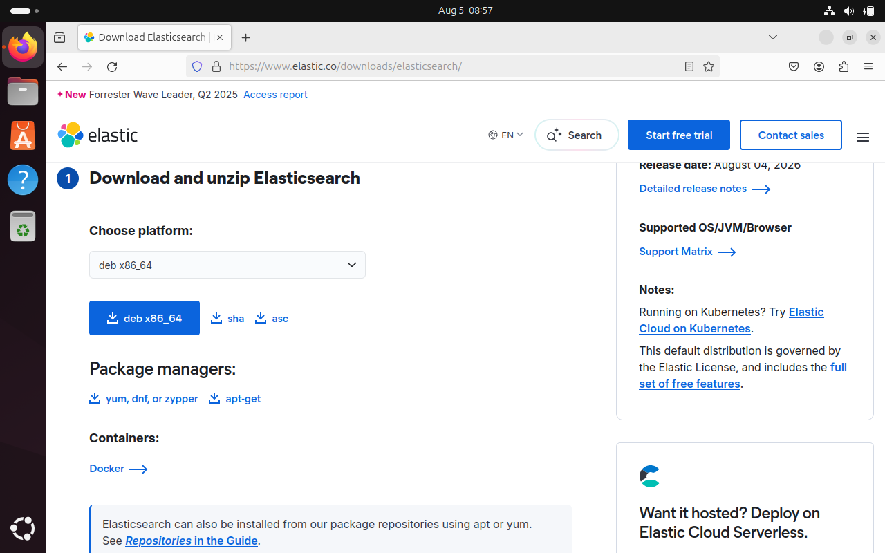
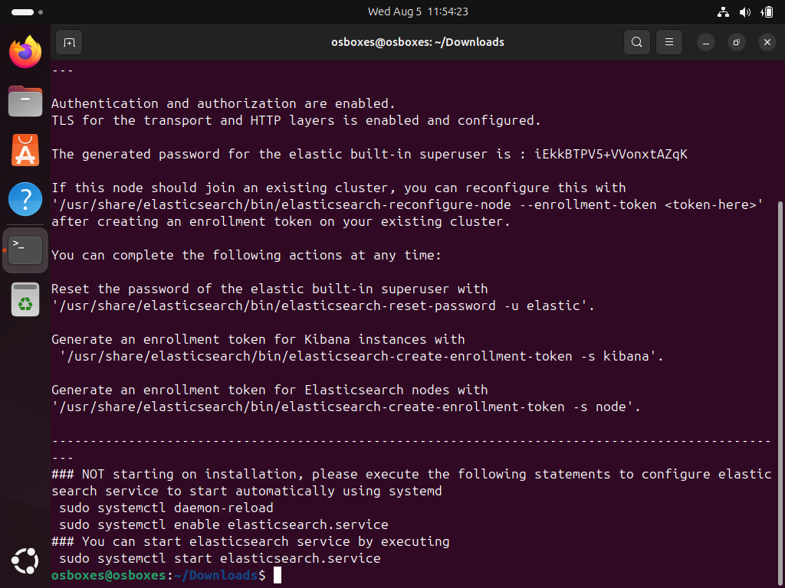
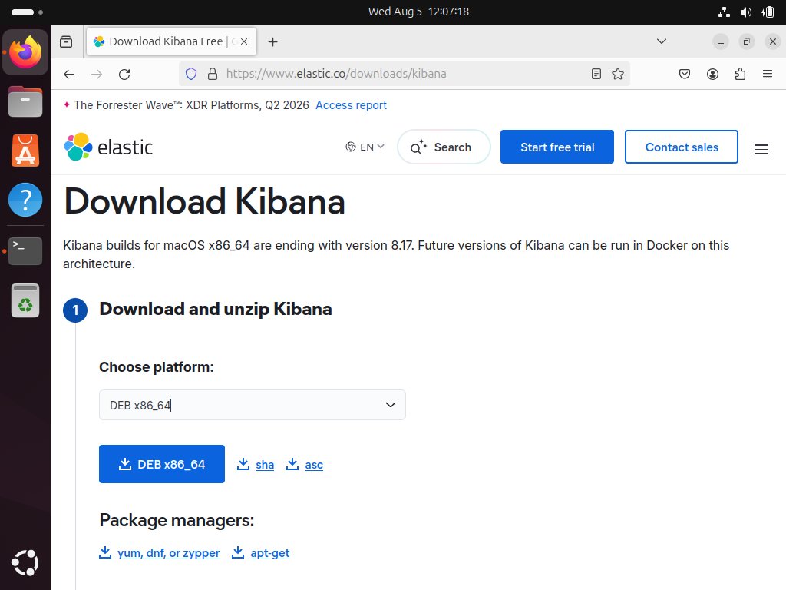
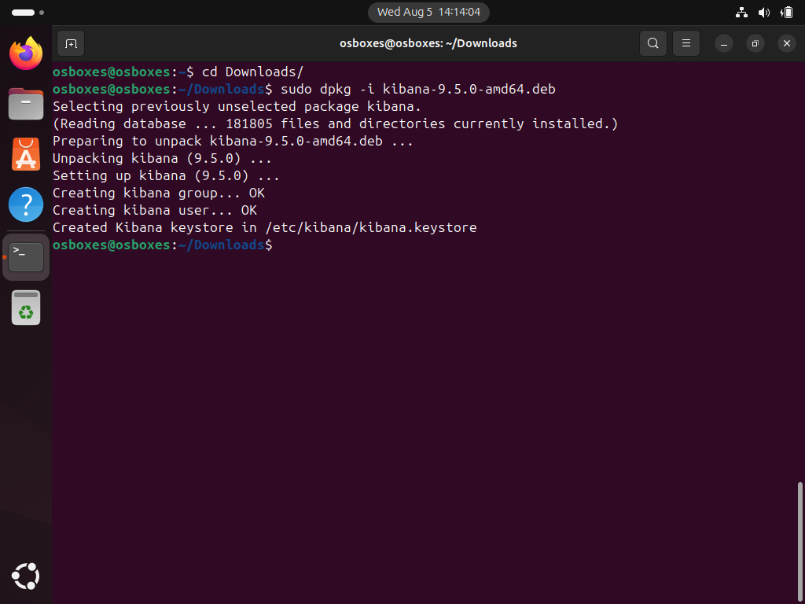
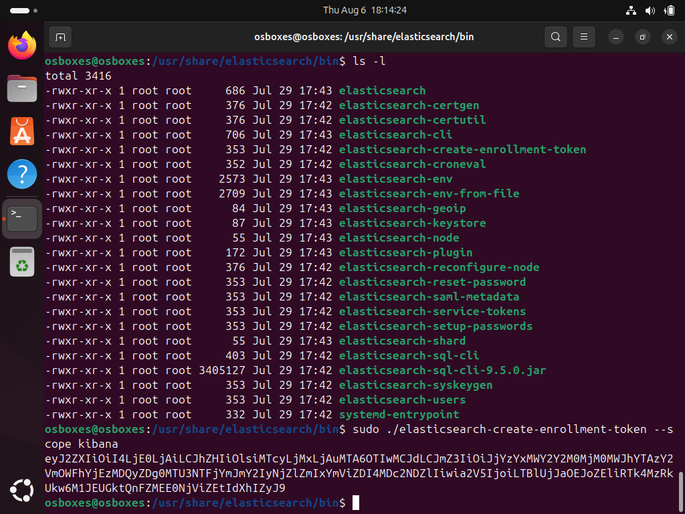
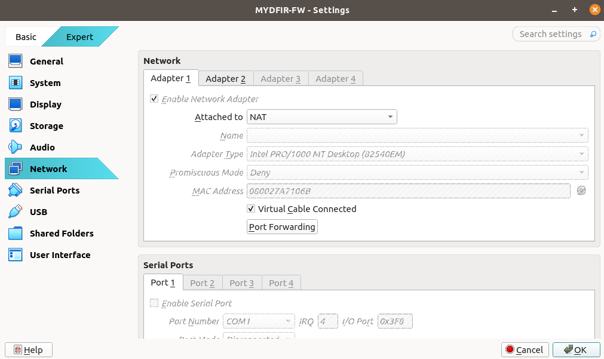
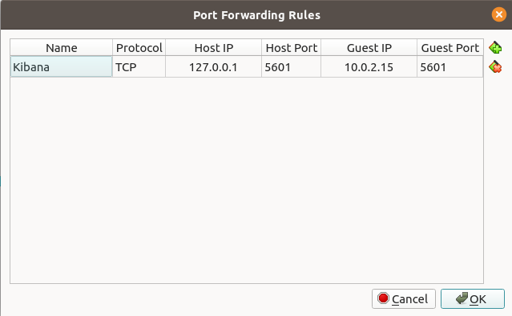
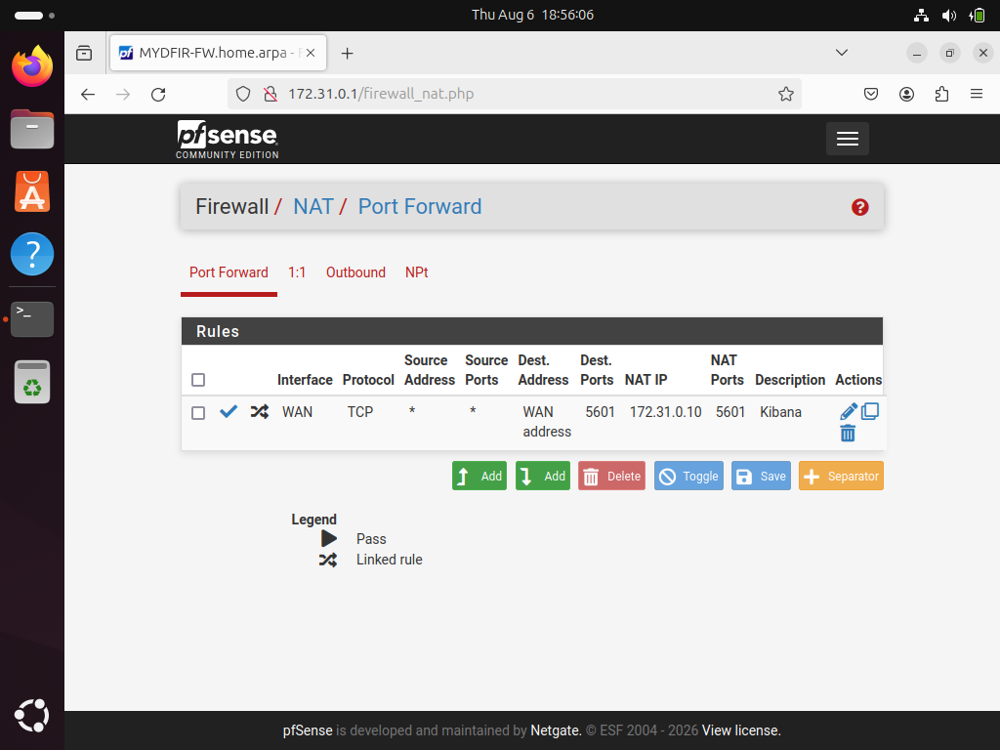
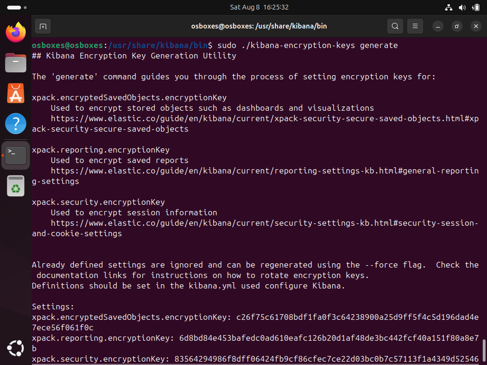
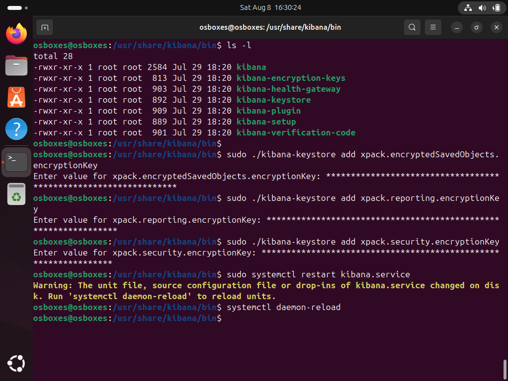

## pfSense Firewall

The first step is to deploy a pfSense firewall that will act as the gateway for the isolated lab network.

The LAN network uses `172.31.0.0/24`, while the WAN interface receives its IP address via DHCP. This provides the isolated lab network with external connectivity while keeping the lab hosts separated from the physical network.

[](VirtualBox_MYDFIR-FW_WAN_LAN_Network_Configuration.png)

The ELK server is running **Ubuntu 24.04** Desktop, downloaded from [osboxes.org](https://www.osboxes.org/ubuntu/). I chose the Desktop edition instead of Ubuntu Server simply because it makes screenshots and demonstrations easier to follow.

## Installing Elasticsearch

We will proceed to download Elasticsearch from the following link:

[Download Elasticsearch](https://www.elastic.co/downloads/Elasticsearch)

[](Download_Elasticsearch.png)

Once the download is complete, we will move to the Downloads folder and execute the installation with:

```bash
sudo dpkg -i elasticsearch-9.4.3-amd64.deb
```

[](Elasticsearch_installation.png)

Once the installation is complete, the installer displays the post-installation steps.

We need to update `Elasticsearch.yml` so Elasticsearch listens on the lab network instead of only the localhost interface.

```bash
sudo nano /etc/elasticsearch/elasticsearch.yml
```

[](editing_Elasticsearch.yml.png)

Next, we enable Elasticsearch to start automatically at boot, start the service, and verify that it is running.

```bash
sudo systemctl daemon-reload
sudo systemctl enable elasticsearch.service
sudo systemctl start elasticsearch.service
sudo systemctl status elasticsearch.service
```

[](starting_and_enabling_Elasticsearch.png)

As we can see, the Elasticsearch service has started.

## Installing Kibana

Next, we download and install Kibana. We can download it from the following link:

[Download Kibana](https://www.elastic.co/downloads/kibana)

[](Download_Kibana.png)

Execute the installation with:

```bash
sudo dpkg -i kibana-9.4.3-amd64.deb
```

[](Kibana_installation.png)

Before starting the service, we need to edit `kibana.yml` and configure the host and port information.

[](editing_kibana.yml.png)

Once that's done, we will proceed to start the Kibana service with the following commands:

```bash
sudo systemctl daemon-reload
sudo systemctl enable kibana.service
sudo systemctl start kibana.service
sudo systemctl status kibana.service
```

[](starting_and_enabling_kibana.png)

### Kibana enrollment token

With Kibana running, we now need to generate an enrollment token. This token is used to securely connect Kibana to the Elasticsearch instance.

```bash
cd /usr/share/elasticsearch/bin
ls -l
sudo ./elasticsearch-create-enrollment-token --scope kibana
```

The `--scope kibana` option generates an enrollment token specifically for configuring Kibana.

[](Elasticsearch_Kibana_enrollment_token.png)

Because my host machine will act as the analyst workstation, I need a way to access Kibana from the host. To accomplish this, I'll configure port forwarding in VirtualBox.

In VirtualBox, open the VM's Settings → Network → Adapter 1 → Port Forwarding.

[](NAT_Port_Forward_button.png)

This is the rule we will add. This forwards a port on the host into the pfSense VM's WAN interface.

[](NAT_Port_Forward_rule.png)

We also need to configure a second port forward on pfSense. In the pfSense web GUI navigate to:

Firewall → NAT → Port Forward → Add

[](pfsense_NAT_rule.png)

We can now open a web browser on the analyst workstation and navigate to `http://localhost:5601`. This should bring up the Kibana setup page, where we can paste the enrollment token generated earlier.

Click the `Configure Elastic` button to continue.

[](configure_Elastic_with_enrollment_token.png)

Next, Kibana displays a verification code that should be entered into the console. In my case, this step did not work as expected. The script to generate the verification code did not work for me. However, after checking the Kibana service status with `sudo systemctl status kibana`, I was able to find the verification code there and continue with the setup.

[](configure_Elastic_verification_code.png)

Kibana will now complete the remaining configuration automatically.

[](configure_Elastic_completing_setup.png)

Finally, we should see the Kibana home screen.

[](configure_Elastic_home_screen.png)

### Kibana encryption keys

The next step is to generate the encryption keys required by Kibana.

[](Kibana_encryption_keys.png)

We then add these keys to the Kibana keystore.

[](Kibana_Keystore.png)

With these steps completed, the Elasticsearch and Kibana components of the lab are now up and running.

## Next Steps

In the next section of the challenge, we will continue building the environment by deploying our **Fleet Server** and **Windows Server**. The Fleet Server will allow us to centrally manage Elastic Agents, while the Windows Server will provide the telemetry needed for our future detection and DFIR activities.

We will also begin collecting Windows telemetry that will become increasingly useful as we continue through the challenge.
