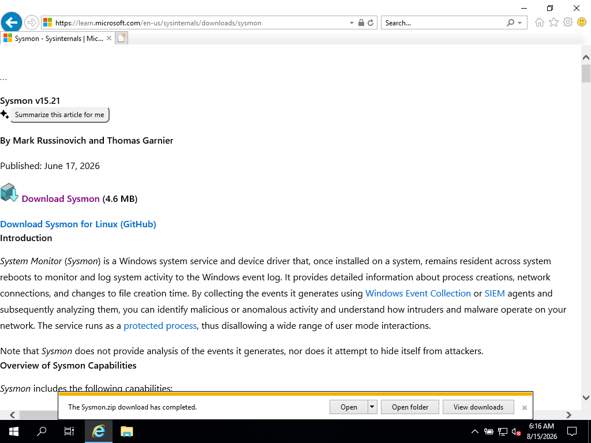
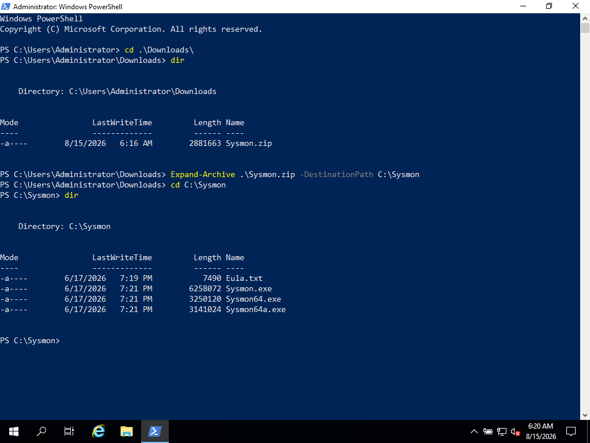
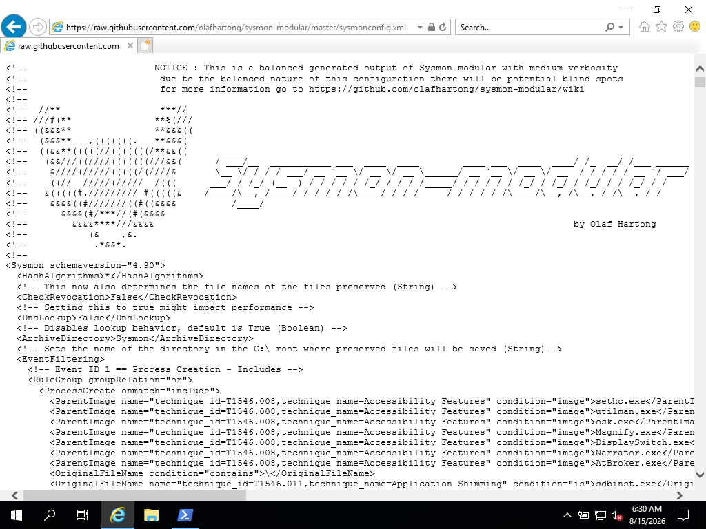
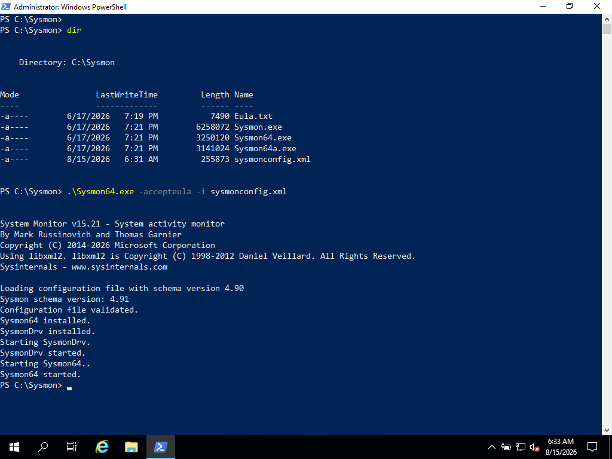
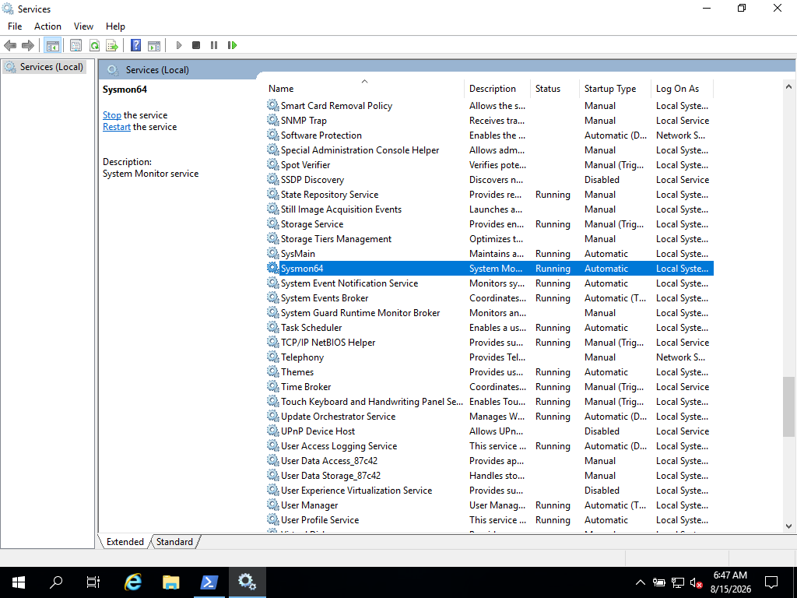
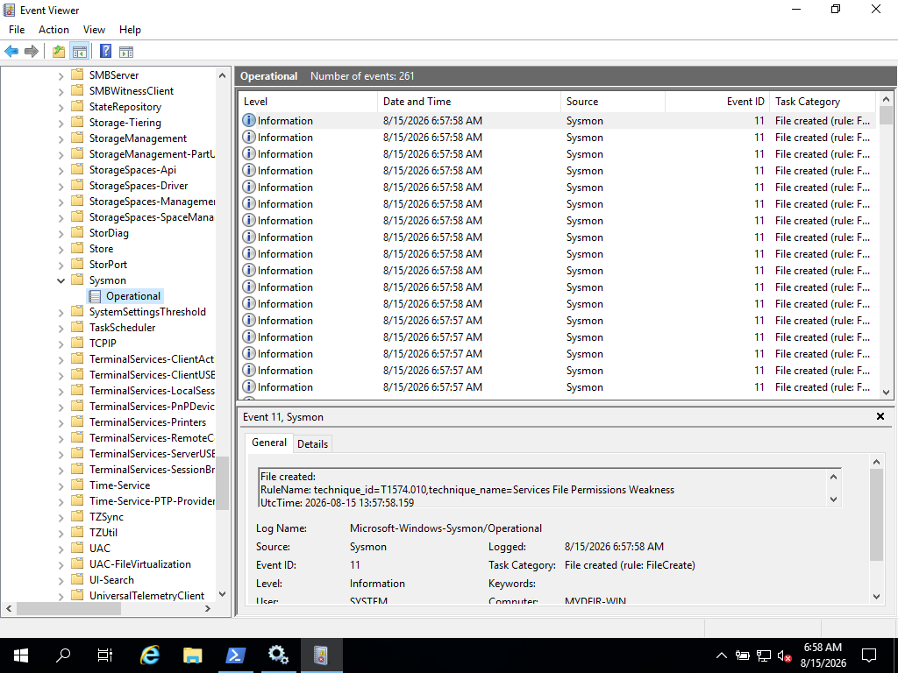

## Introduction

In the previous section, we deployed our Windows Server 2019 VM and enrolled the Elastic Agent with our Fleet Server.

Now that the Windows Server is communicating with Elastic, we can improve the telemetry collected from the system by installing **Sysmon (System Monitor)**.

Sysmon is a Windows system service and device driver that provides detailed information about system activity, including process creation, network connections, file creation, and other events that can be useful during DFIR investigations and threat hunting.

## Downloading Sysmon

Sysmon is part of the Microsoft Sysinternals suite.

From the Windows Server, download Sysmon from the Microsoft Sysinternals website.

[Download Sysmon](https://learn.microsoft.com/en-us/sysinternals/downloads/sysmon)

[](Download_Sysmon_from_Microsoft_Learn.png)

After downloading the archive, extract its contents to a directory on the Windows Server.

[](Extracting_Sysmon_Zip_file.png)

### Installing Sysmon

Before installing Sysmon, we need to decide which configuration we want to use.

Sysmon can be installed using its default configuration, but for security monitoring and DFIR purposes, a more comprehensive configuration is preferable.

For this lab, we will use a Sysmon configuration developed by Olaf Hartong to provide additional security telemetry.

The repository on GitHub:
[https://github.com/olafhartong/sysmon-modular](https://github.com/olafhartong/sysmon-modular)

Download the default `sysmonconfig.xml` to the same folder where we have Sysmon and install.

[](Downloading_Sysmonconfig_xml.png)

The installation command follows this format:

```powershell
.\Sysmon64.exe -accepteula -i sysmonconfig.xml
```

[](Installing_Sysmon_with_Config_file.png)

The `-accepteula` option automatically accepts the Sysinternals license agreement, while `-i` installs the Sysmon service using the specified configuration file.

After running the command, Sysmon should be installed as a Windows service.

### Verify the Installation

We can verify that the Sysmon service is running by using the Windows Services console:

[](Verifying_Sysmon_Installation_Service.png)

We should see the service with a status of **Running**

At this point, Sysmon is installed and running on our Windows Server. It is now generating additional Windows telemetry that can be collected by the Elastic Agent.

### Verify Sysmon Events

We can also verify that Sysmon is generating events by opening the Windows Event Viewer.

Navigate to:

**Applications and Services Logs > Microsoft > Windows > Sysmon > Operational**

[](Sysmon_Operational_Event_Log.png)

Here we can see the events generated by Sysmon on our Windows Server.

These events provide additional information about activity occurring on the system, such as process creation, network connections, and other events depending on the configuration we installed.

## Next Steps

With Sysmon installed and generating additional telemetry, our Windows Server is now producing valuable data that can be used for DFIR investigations and threat hunting.

However, generating telemetry is only part of the process. We now need to make sure this data is collected and sent to our Elastic environment.

In the next section, we will look at **how to ingest data into Elasticsearch** and begin working with the data generated by our Windows Server.
