## Introduction

In the previous section, we installed **Sysmon** on our Windows Server 2019 VM to collect additional security telemetry.

Now, we need to ensure that this data is collected by the **Elastic Agent** and ingested into **Elasticsearch** so that we can search and analyze it using **Kibana**.

## Adding Sysmon Integration

Once we are logged into Kibana, click on the **Add Integrations** button.

[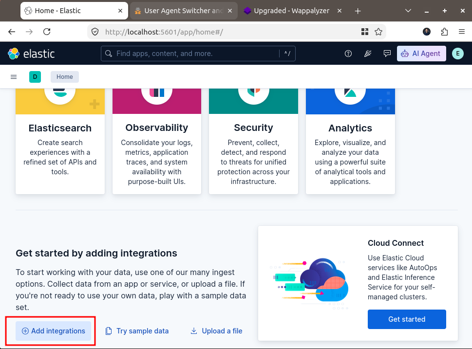](Add_Integrations_button.png)

Search for **Windows Events** and click to select the **Custom Windows Event Logs**.

[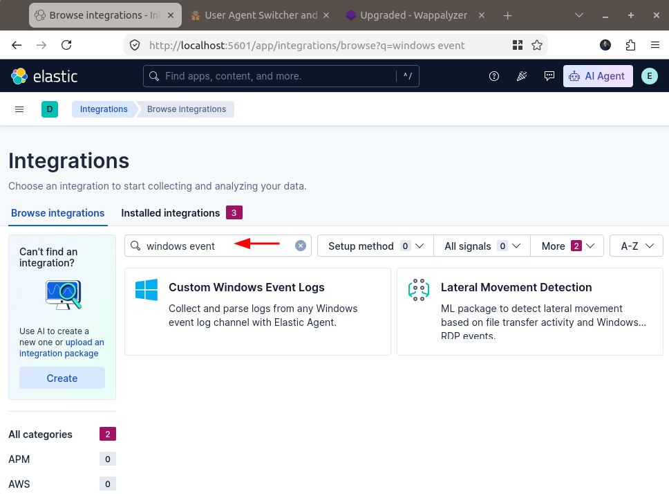](Search_Windows_Events.png)

Click **Add Custom Windows Event Logs**

[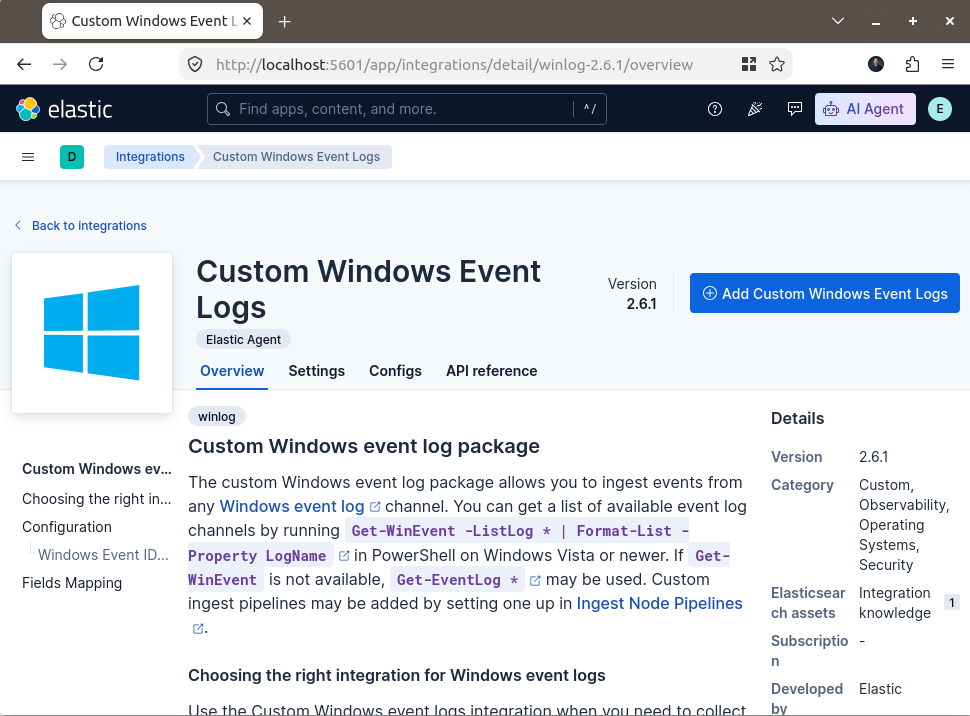](Add_Custom_Windows_Event_Logs.png)

### Configure the Sysmon Integration

Configure the **Integration information** by entering a name and description for the integration.

[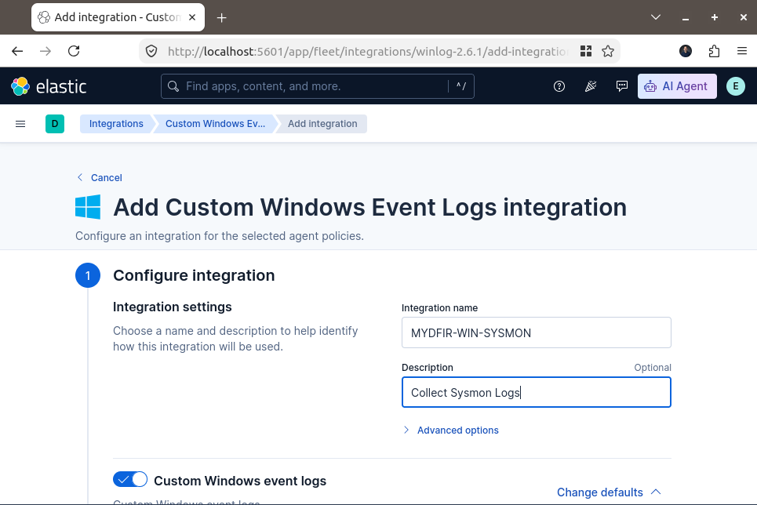](Configure_Integration.png)

Scroll down to the **Custom Windows event logs** section.

For the Channel Name, enter the following: `Microsoft-Windows-Sysmon/Operational`

[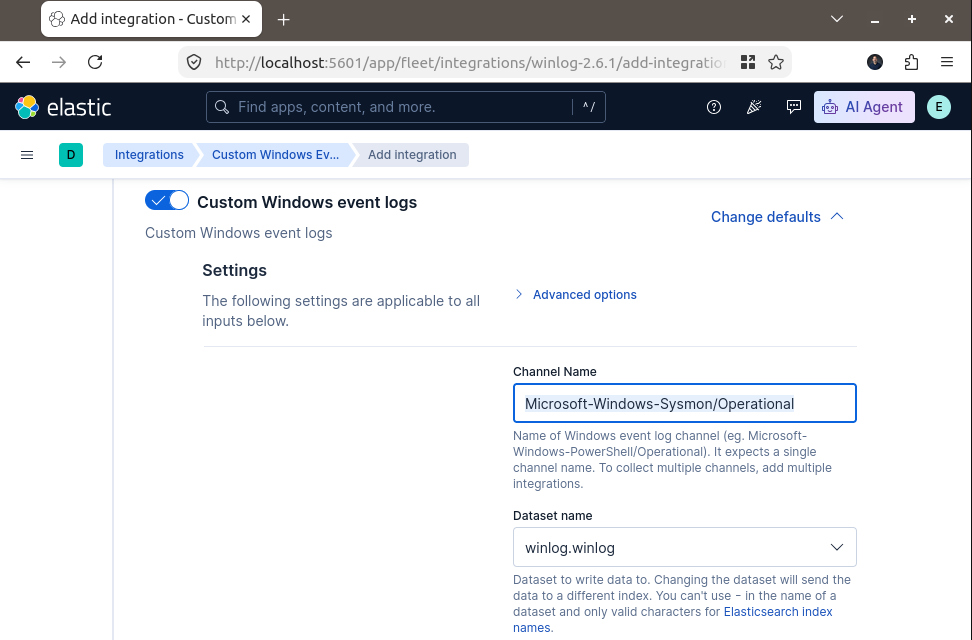](Channel_name.png)

Scroll down to **\*Step 2: Where to add this integration?**

Select **Agent policy** and choose **MYDFIR-WIN-POLICY**.

[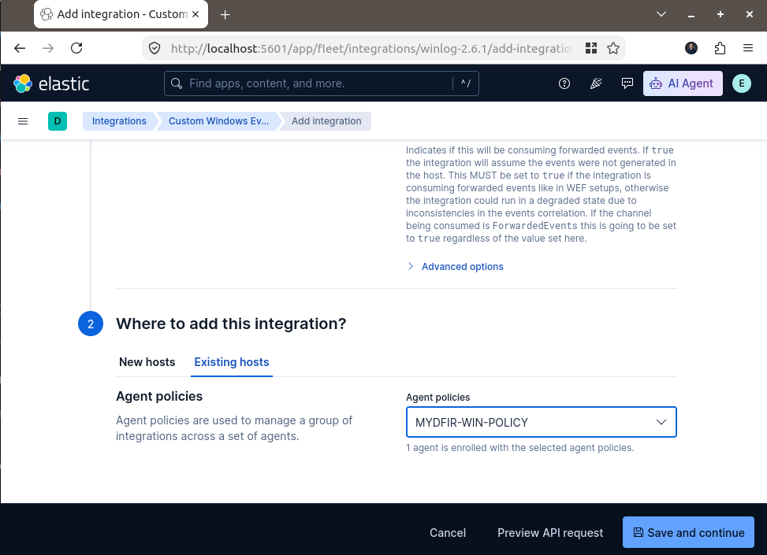](Integration_Agent_Policy.png)

Click **Save and continue**. In the popup window, click **Save and deploy changes**.

[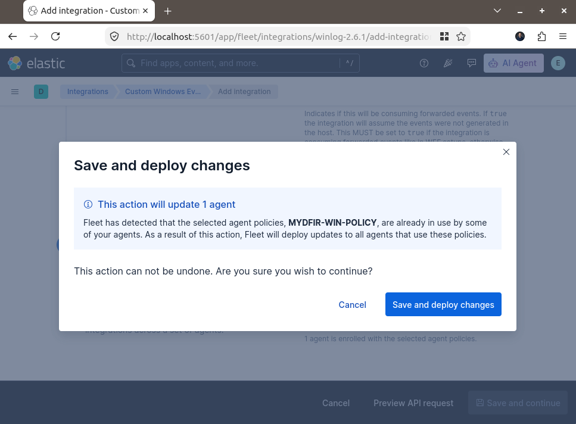](Save_and_deploy_changes.png)

The Sysmon integration has now been added to our Windows agent policy.

## Integrating Windows Defender

Next, we will configure another integration to collect Windows Defender events.

Go back to **Integrations** and click on the **Add Integrations** button.

Search for **Windows Events** and select **Custom Windows Event Logs**.

Click **Add Custom Windows Event Logs**

### Configure the Windows Defender Integration

Under Integration information, enter the following:

Name: `MYDFIR-WIN-DEFENDER`
Description: `Collect Defender Logs`

[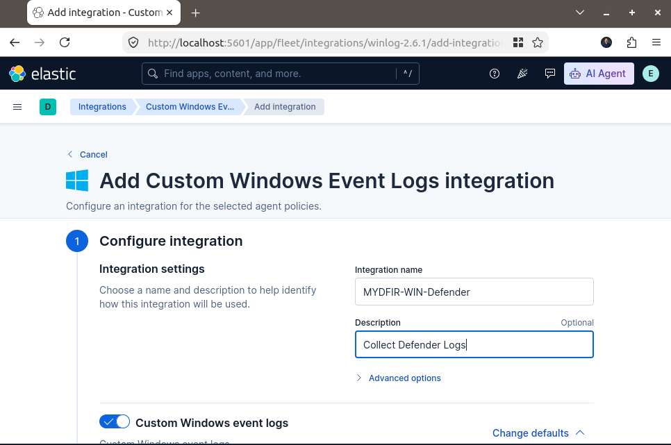](Integration_settings.png)

Scroll down to **Custom Windows event logs** and enter the following channel name:

`Microsoft-Windows-Windows Defender/Operational`

Under **Advanced Options**, locate the **Event ID** field.

[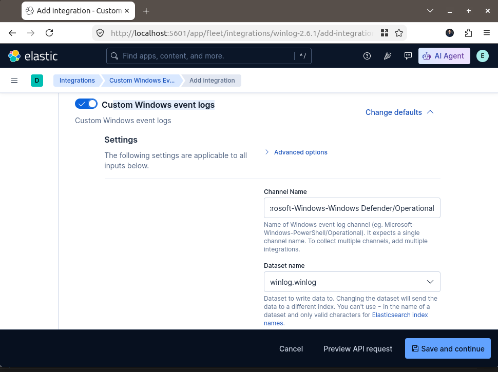](Custom_window_event_logs.png)

Enter the following event IDs: `1116,1117,5001`

These events are associated with malware or potentially unwanted software detection, remediation actions, and real-time protection being disabled.

[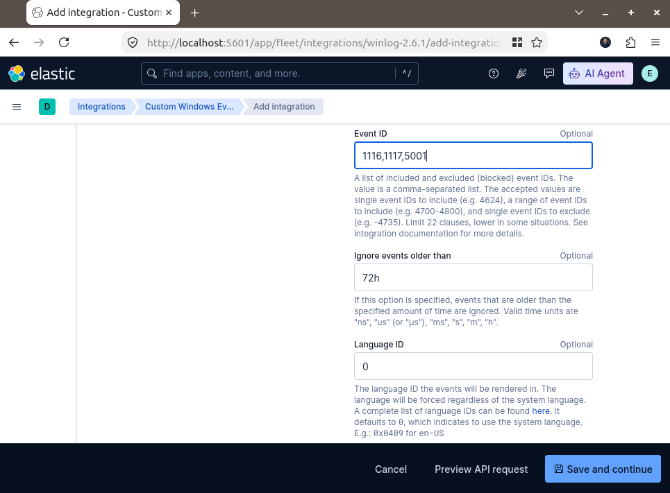](Event_IDs.png)

Under **Step 2: Where to add this integration?**, select the same agent policy used for the Sysmon integration: **MYDFIR-WIN-POLICY**.

Click **Save and continue**. In the popup window, click **Save and deploy changes**.

We have now added both integrations to our Windows agent policy:

**MYDFIR-WIN** — collects Sysmon events.
**MYDFIR-WIN-DEFENDER** — collects Windows Defender events.

[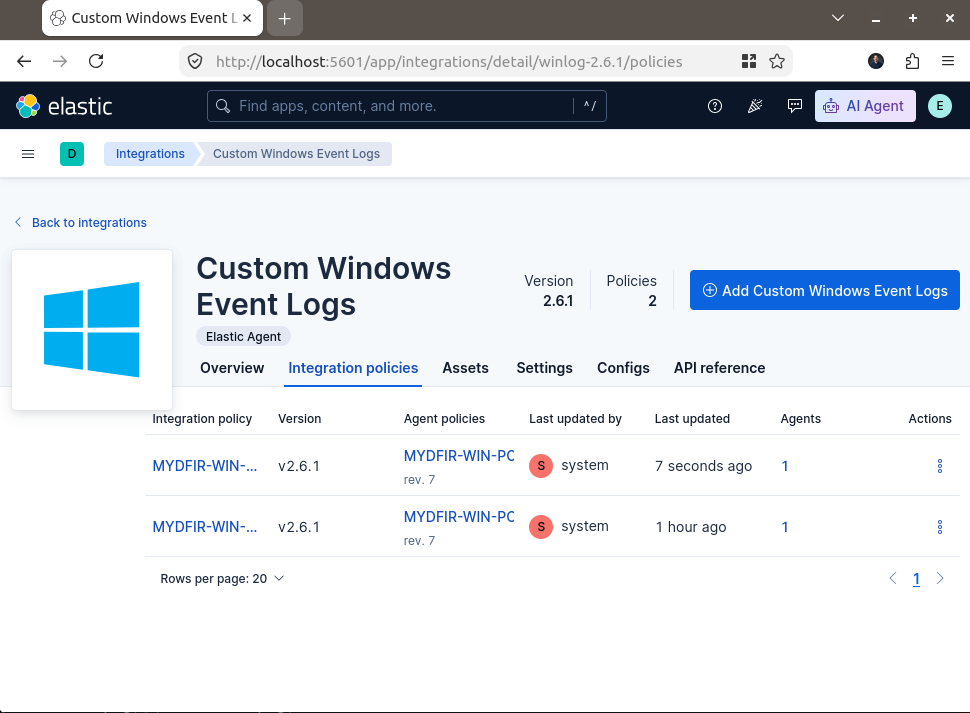](Custom_windows_event_logs.png)

We have now added two integrations to our Windows agent policy:

**Sysmon integration** — collects events from the Sysmon Operational channel.

**Windows Defender integration** — collects events from the Windows Defender Operational channel.

Both integrations are assigned to the **MYDFIR-WIN-POLICY** agent policy, allowing the Elastic Agent on our Windows Server to collect events from both channels.

## Verify the Elastic Agent

Go to Management > Fleet > Agents and check that the Windows Server agent is healthy and that the updated policy has been applied.

[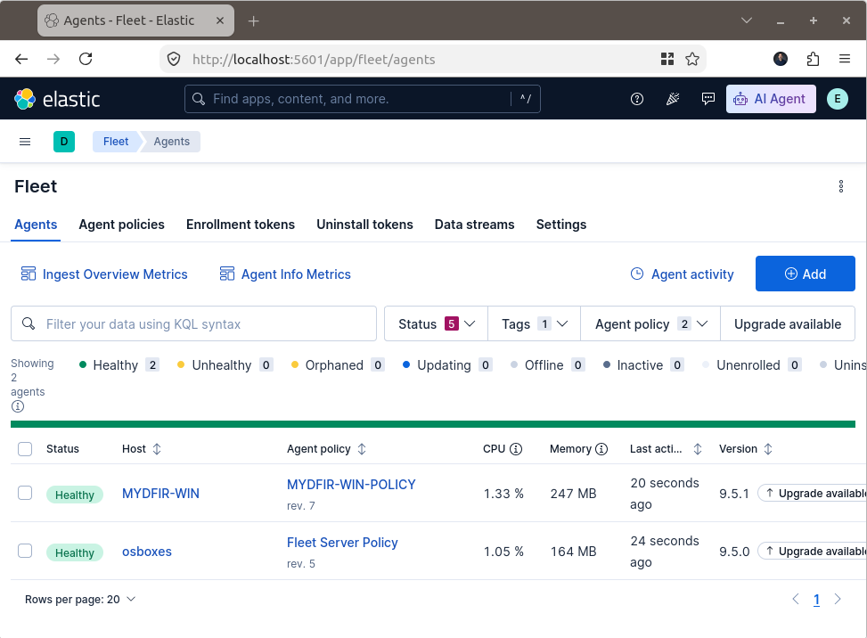](verify_healthy_policy.png)

## Search for the events in Kibana

Open Analytics > Discover, select the appropriate data view, and search for events from your Windows Server. You can filter by the agent name and the Sysmon or Defender event channel.

You can use these KQL filters:

**Sysmon events**:

`agent.name: "MYDFIR-WIN" and winlog.channel: "Microsoft-Windows-Sysmon/Operational"`

[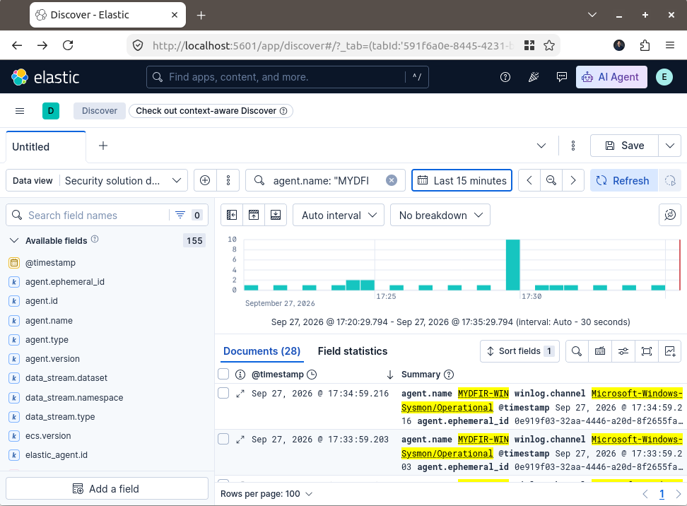](Sysmon_events.png)

**Windows Defender events**:

`agent.name: "MYDFIR-WIN" and winlog.channel: "Microsoft-Windows-Windows Defender/Operational"`

[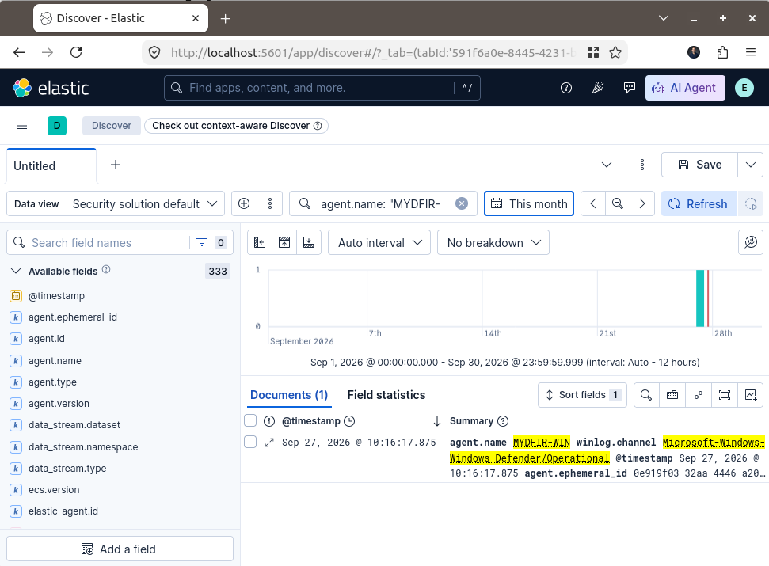](Windows_Defender_events.png)

To filter for the Defender event IDs you configured:

`agent.name: "MYDFIR-WIN" and winlog.event_id: (1116 or 1117 or 5001)`

[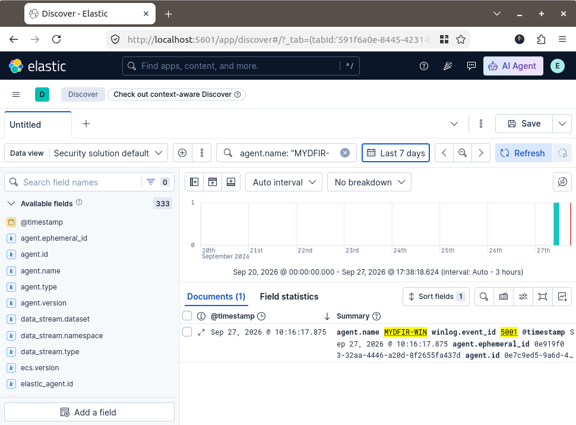](Defender_event_ID.png)

## Troubleshooting

Briefly cover what to check if no events appear:

Confirm the Elastic Agent is healthy.

Confirm Sysmon is running and generating events.

Verify the channel names and event ID filters.

Check that the integrations are assigned to the correct agent policy.

**One technical detail**: Event ID 5001 is associated with Windows Defender real-time protection being disabled. The other two IDs relate to threat detection and remediation. Make sure the events you want to collect match the event IDs configured in the integration.

## Conclusion

In this section, we configured two Custom Windows Event Logs integrations to collect Sysmon and Windows Defender events from our Windows Server 2019 VM.

We assigned both integrations to the **MYDFIR-WIN-POLICY** agent policy, verified that the Elastic Agent was healthy, and searched for the collected events in Kibana Discover.

With these integrations in place, we can begin exploring the security telemetry generated by our Windows Server and use it for further investigation in our Elastic lab.
