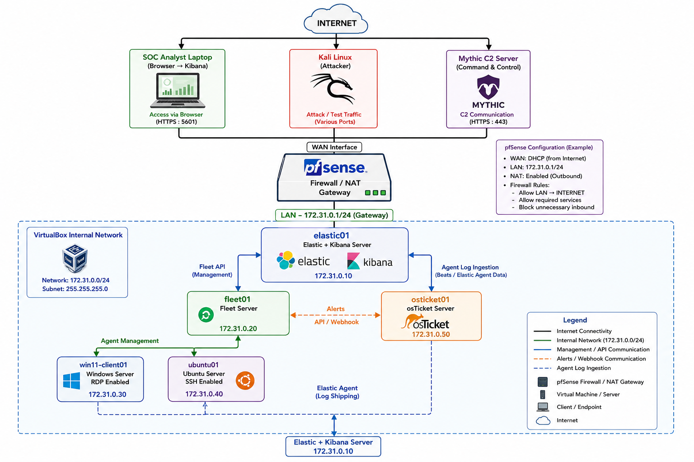

## Overview

I decided to take on the MYDFIR 30-Day Elastic Challenge to improve my skills. The MYDFIR 30-Day Elastic Challenge is a hands-on DFIR learning experience designed around an Elastic-based security monitoring environment.

For this project, I decided to deploy the entire lab environment locally on my laptop using VirtualBox rather than running the environment in the cloud.

## Lab Architecture

The following diagram shows the lab environment that will be deployed throughout this guide.

## Lab Components

The lab consists of several virtual machines connected through an isolated network. The lab components include:

- pfSense Firewall
- Elasticsearch
- Kibana
- Windows Server
- Ubuntu Server
- Fleet Server
- osTicket

The ELK server will host Elasticsearch and Kibana and will serve as the central platform for collecting and analyzing security telemetry.

The lab network uses `172.31.0.0/24`, with pfSense acting as the gateway.

## Lab Setup
